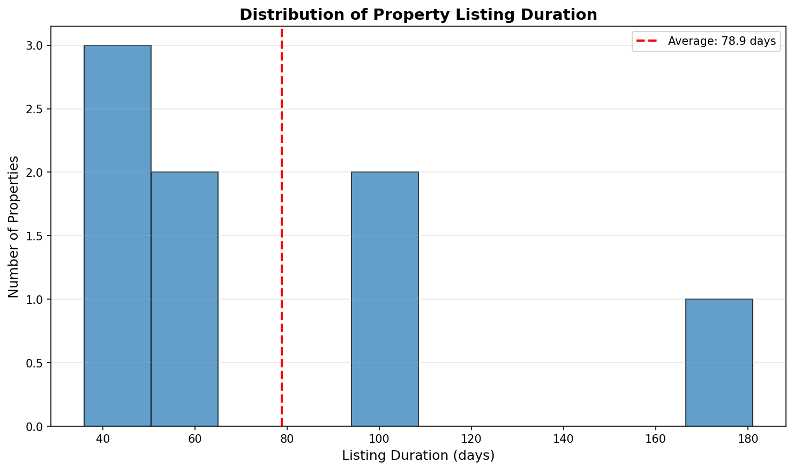
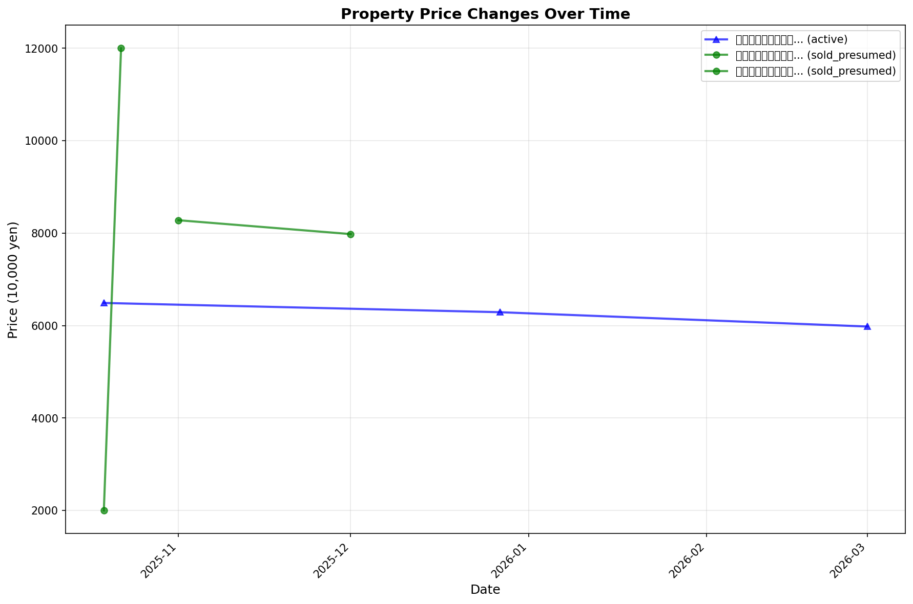
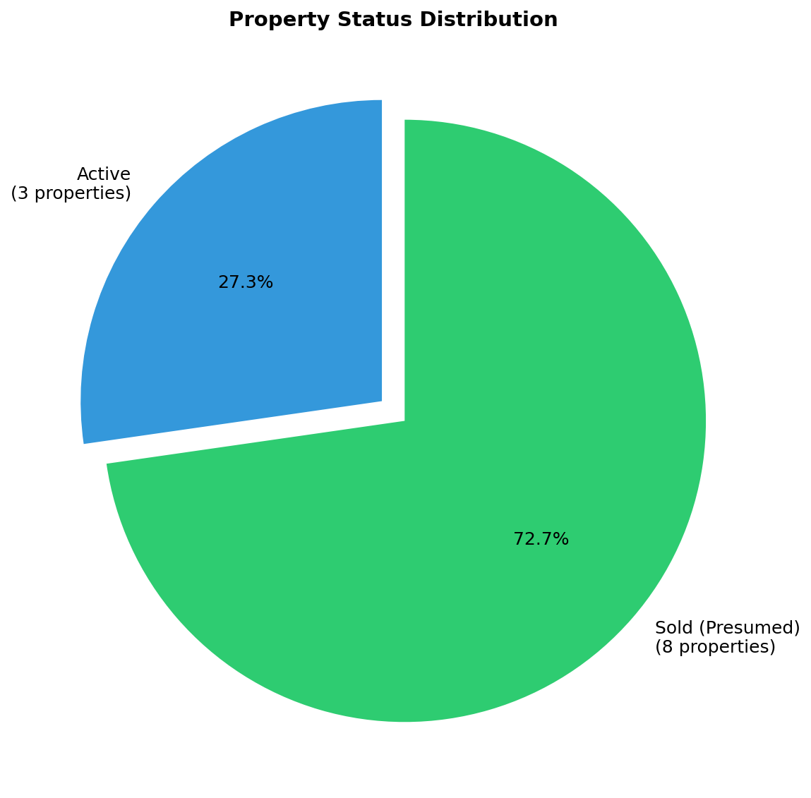
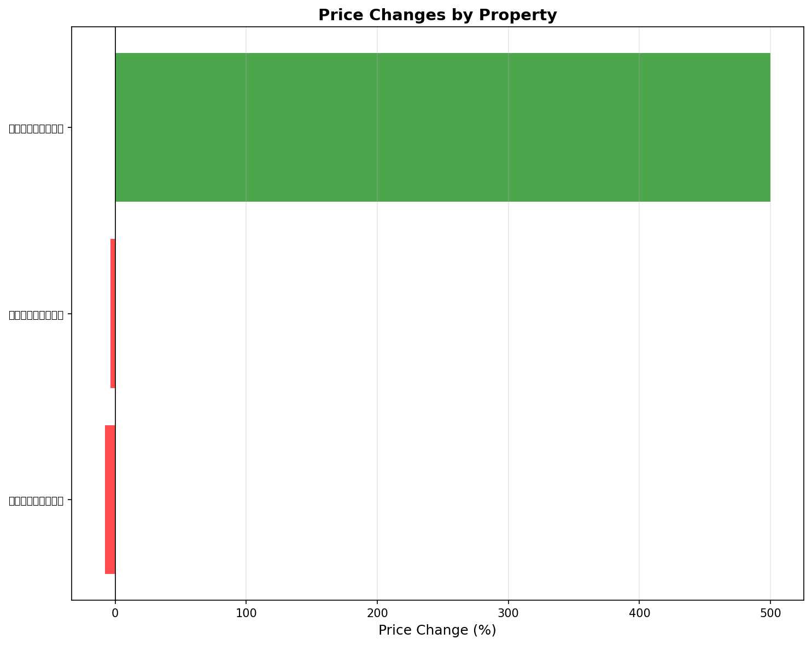

# 📊 スムストック物件追跡ダッシュボード

スムストックに掲載されている物件の販売状況を時系列で追跡し、分析した結果を公開しています。

---

## 📈 最新の分析レポート



---

## 📊 グラフで見る市場動向

### 販売期間の分布

物件が売れるまでに何日かかるかの分布を示しています。

### 価格変動タイムライン

各物件の価格推移を時系列で表示しています。値下げ・値上げのパターンが見えます。

### 販売状況の分布

現在販売中の物件と販売終了（売却済み推定）の物件の割合を示しています。

### 価格変動の詳細分析

各物件がどれだけ値下げ・値上げしたかを一覧で表示しています。

---

## 🏢 国土交通省データとの照合


国土交通省の不動産取引価格情報との照合結果です（参考情報）。

[MLIT照合レポートを見る](data/mlit_matching_report.md)

MLIT APIキーが設定されていないため、照合は行われていません。


---

## 💡 このデータの見方

### 平均販売期間
物件が掲載されてから売却されるまでの平均日数です。この数値が短いエリアは需要が高く、長いエリアは売れにくい傾向があります。

### 価格変動率
初回掲載価格から最終価格までの変動率です。マイナスは値下げ、プラスは値上げを示します。

### 販売終了（推定）
前月のスクレイピングで存在していた物件が、今月のスクレイピングで見つからない場合、「販売終了（売却済みと推定）」としてカウントしています。

---

## 📚 ドキュメント

- [クイックスタートガイド](docs/QUICK_START_TRACKING.html)
- [システム概要](PROPERTY_TRACKING_SUMMARY.html)
- [詳細な提案書](docs/sold_property_tracking_proposal.html)
- [実装報告](docs/property_tracking_implementation.html)

---

## 🔄 データ更新スケジュール

- **物件データ**: 毎月1日に自動スクレイピング
- **追跡分析**: 毎月2日に自動実行
- **このページ**: 分析完了後に自動更新

---

## ⚠️ 注意事項

- このデータは自動的に収集・分析されたものです
- 「販売終了」は推定であり、確実な売却情報ではありません
- 価格や物件情報は参考値としてご利用ください
- 最新の正確な情報は[スムストック公式サイト](https://sumstock.jp/)でご確認ください

---

## 📊 統計データ（JSON）

技術者向けに、追跡データベースを公開しています。

- [tracking_db.json](tracking_db.json) - 物件追跡データベース

---

**最終更新**: {{ site.time | date: "%Y年%m月%d日 %H:%M" }}
